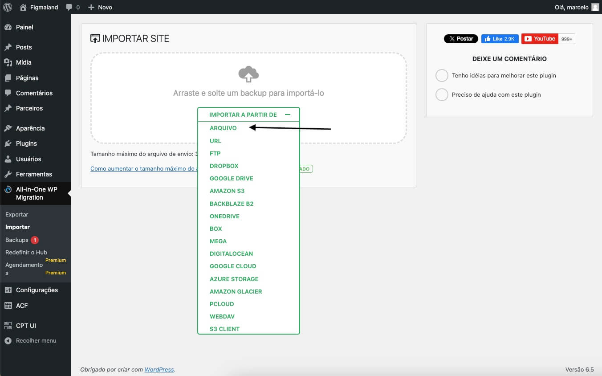

<h2>Instruções sobre instalação completa do site:</h2>

 Crie uma instalação limpa do Wordpress;

 2 - Instale o plugin <a href="https://wordpress.org/plugins/all-in-one-wp-migration/" target="_blank">All-in-One WP Migration</a>, pois o usaremos para migrar o site que está na pasta site do repositório;

3 - Após ativar o plugin, é só selecionar a opção importar. Vai aparecer uma opção para fazer o upload do arquivo. Então selecione a opção IMPORTAR A PARTIR DE: ARQUIVO

4 - O arquivo a ser selecionado é figmaland-local-20240408-201921-2lzyux.wpress. 

<h2>Sobre o site construído:</h2>

Todos os campos são dinâmicos e editáveis na página home;
A área de parceiros são editáveis e foi construído com Custom post type;

Foram criados menus para footer e header. Então todos os menus são editáveis e dinâmicos;

Textos, ícones, botões e imagens  são dinâmicos, pois foram criados com campos ACF para cada seção.

## o site foi contruído com a última versão do Worpress, que é 6.5 e usado PHP versão 8.123. 

## Senha e usuário serão fornecidos pelo e-mail: 
hellostudiocontato@gmail.com

